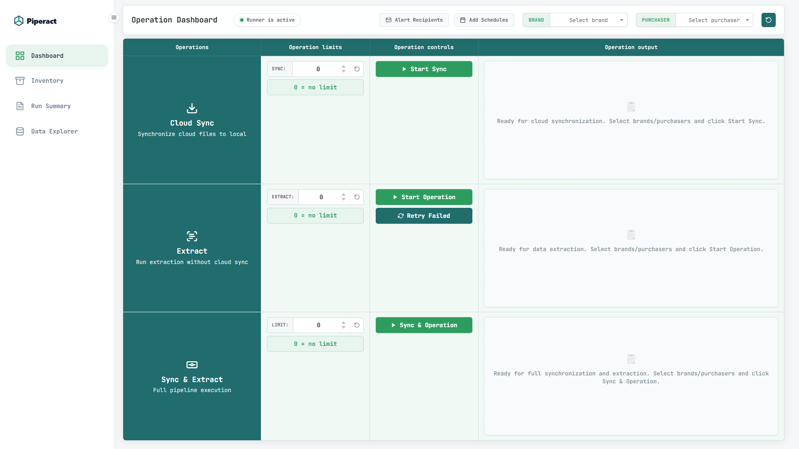
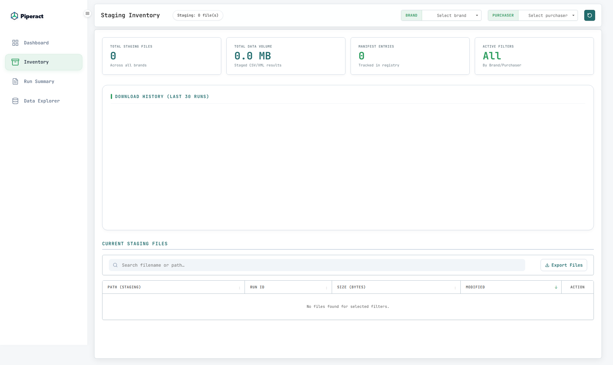
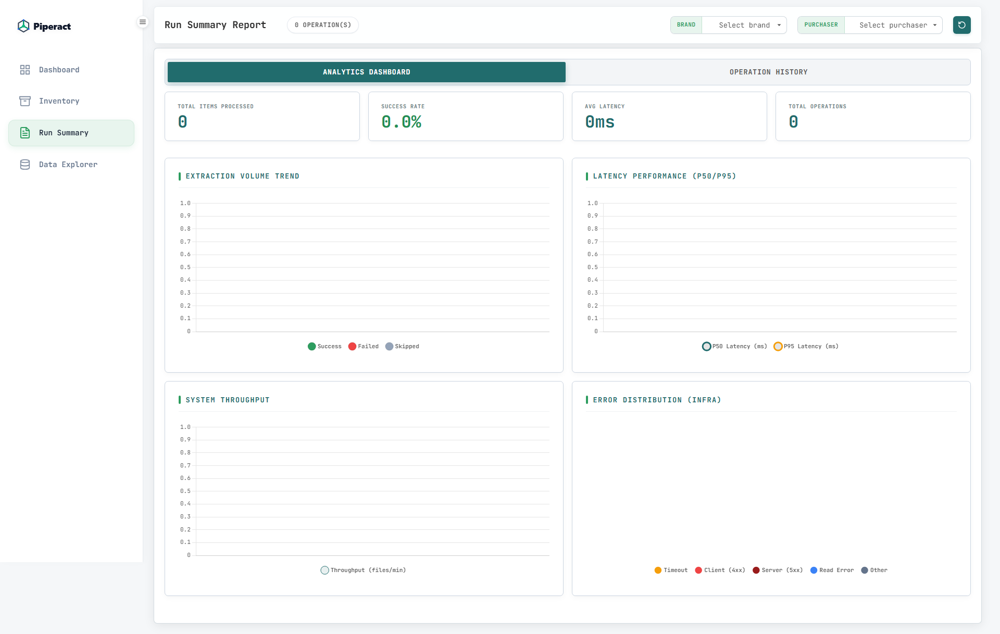
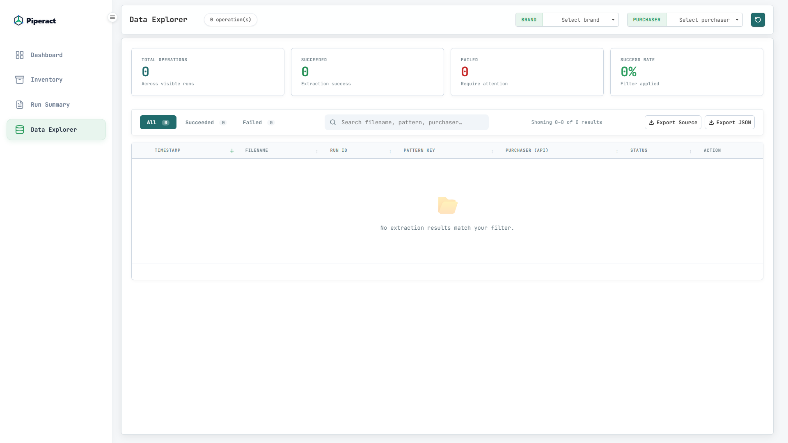

# Xtractor

[](https://github.com/for-qa/xtractor/actions/workflows/ci.yml)

**A Professional, High-Performance Extraction Orchestrator & Dashboard**

Xtractor is a high-performance TypeScript application designed to orchestrate large-scale data extraction. Built on **Clean Architecture** principles, it provides a robust CLI and a stunning Web Dashboard for managing S3 synchronization, batch extraction, scheduling, and analytics.



<details>
<summary><b>✨ View More Dashboard Features (Inventory, Analytics, Data Explorer)</b></summary>
<br>

### 📦 Staging Inventory
Tracks S3 file synchronization state and locally staged data volumes.


### 📊 Run Summary Analytics
Provides latency tracking, throughput metrics, and error distribution.


### 🔍 Data Explorer
Browse and export raw extraction results directly from the browser.


</details>

---

## 🏗️ Architecture & Design Principles

This project is built to enterprise standards for maintainability and scalability:

- **Clean Architecture**: Strict separation of concerns between Domain, Use Case, Adapter, and Infrastructure layers.
- **SOLID Principles**: Focused repositories, dependency inversion via interfaces, and single-responsibility services.
- **High-Grade Type Safety**: Strict TypeScript implementation with minimal `any` usage, ensuring robust contracts between layers.
- **SQL-Based Persistence**: Powered by SQLite for high-concurrency, ACID-compliant storage of extraction records, sync manifests, and schedules.

---

## ✨ Key Features

- **🚀 Triple-Mode Execution**:
  - **Sync**: Pull files from S3 with SHA-256 integrity checks.
  - **Run**: Batch extract local staging files with aggressive RPS and concurrency controls.
  - **Pipeline (sync-extract)**: Seamlessly sync and extract files in a high-throughput stream.
- **📊 Real-time Dashboard**: A premium, glassmorphism-inspired Web UI with real-time progress bars, performance charts, and historical run analytics.
- **⏰ Smart Scheduler**: Built-in cron manager with persistent storage. Schedule individual tenant/purchaser jobs with custom frequencies.
- **📧 Consolidated Reporting**: Automated professional HTML failure reports sent via SMTP/Nodemailer, featuring throughput metrics and latency P/percentiles.
- **⏯️ Resumable States**: Intelligent checkpointing allows interrupted runs to resume exactly where they left off, skipping completed files.
- **🔍 Advanced Analytics**: Latency distribution (P50, P95, P99), throughput tracking, and detailed anomaly detection in extraction results.

---

## 🛠️ Tech Stack

This project leverages a robust ecosystem for background processing and high-availability storage:
- **Core Runtime**: Node.js (v20+) with TypeScript
- **Database**: SQLite (`better-sqlite3`) for high-concurrency ACID persistence
- **Cloud Infrastructure**: AWS SDK for S3 operations
- **Job Orchestration**: `p-queue` and `node-cron`
- **Testing**: Vitest for unit coverage

---

## 🛠️ Project Structure

```text
src/
├── core/                # Pure Business Logic
│   ├── domain/          # Entities, Domain Services, Repository Interfaces
│   └── use-cases/       # Orchestration of domain logic
├── adapters/            # Gateways to the outside world
│   ├── controllers/     # Web API logic
│   ├── presenters/      # UI-ready data formatting (HTML/JSON)
│   └── router.ts        # Fast, low-dependency HTTP routing
└── infrastructure/      # Low-level implementations
    ├── database/        # SQLite / Better-SQLite3 implementations
    ├── services/        # AWS S3, Nodemailer, Parent/Child processes
    └── utils/           # Shared technical utilities (Metrics, Logging)
```

---

## 🚀 Getting Started

### 1. Requirements

- **Node.js**: v20 or higher
- **SQLite3**: (Included via `better-sqlite3`)

### 2. Setup

```bash
# Install dependencies
npm install

# Setup environment
cp .env.example .env

# Setup configuration
cp config/config.example.yaml config/config.yaml
```

### 3. Environment Configuration

Edit `.env` with your API credentials:

- `Xtractor_ACCESS_KEY`
- `Xtractor_SECRET_MESSAGE`
- `Xtractor_SIGNATURE`
- `S3_BUCKET` & `S3_TENANT_PURCHASERS` (for sync)

---

## 🖥️ Usage

### Development & Build

```bash
npm run build    # Compile TypeScript to dist/
```

### Browser App (Dashboard)

```bash
npm run app      # Starts the dashboard at http://localhost:8105
```

### CLI Mode

```bash
# Sync files from S3
npm run sync -- --limit 50

# Execute extraction with specific scope
npm start run -- --tenant BRAND_A --requestsPerSecond 5

# High-speed pipeline
node dist/index.js sync-extract --limit 100 --resume
```

---

## 🧪 Testing

The project includes a comprehensive suite of unit tests using **Vitest**.

```bash
npm test                # Run all tests
npm run test:watch      # Watch mode for TDD
npm run test:coverage   # Generate detailed coverage report
```

Current test baseline focuses on:

- Core Use Cases (Sync, Extract, Discovery)
- Domain Logic & Entity validation
- Infrastructure Utilities (Metrics & Path Normalization)

---

## 📊 Benchmarking & Reporting

Benchmarks are generated automatically during every run. View the results in:

- **Web UI**: Detailed charts in the "Analytics" tab.
- **HTML Report**: Generated under `output/reports/report_[id].html`.
- **Metrics tracked**: Throughput (files/sec), Latency distribution (avg, P50, P95, P99), and categorized Error Rates.

---

## 🔒 Security Note

- All real API credentials, AWS keys, and URLs are loaded from `.env` — never hardcoded.
- Secrets support optional **Fernet symmetric encryption** at rest (see `.env.example`).
- Copy `.env.example` → `.env` and fill in your values. **Never commit a real `.env` file.**
- `config/config.yaml` is gitignored. Copy `config/config.example.yaml` to get started.

---

## Support & Recognition

If you find this project helpful and want to support its continued development, the best way is through **recognition**:

1. **Attribution:** Please keep the original copyright notices intact in the code. If you use this tool or its code in a public project, a shoutout or a link back to this repository is highly appreciated!
2. **Contribute Code:** We welcome pull requests! Check out our [CONTRIBUTING.md](CONTRIBUTING.md) for guidelines on how to help build this tool.
3. **Star the Repo:** Giving the project a ⭐️ on GitHub helps others find it and gives the author recognition.

## License

This project is licensed under the [MIT License](LICENSE). 

Under the MIT License, anyone who uses, copies, or modifies this code must include your original copyright notice, ensuring you always receive credit for your work.

---

_For professional inquiries, connect on [LinkedIn](https://www.linkedin.com/in/gairik-singha/)._


