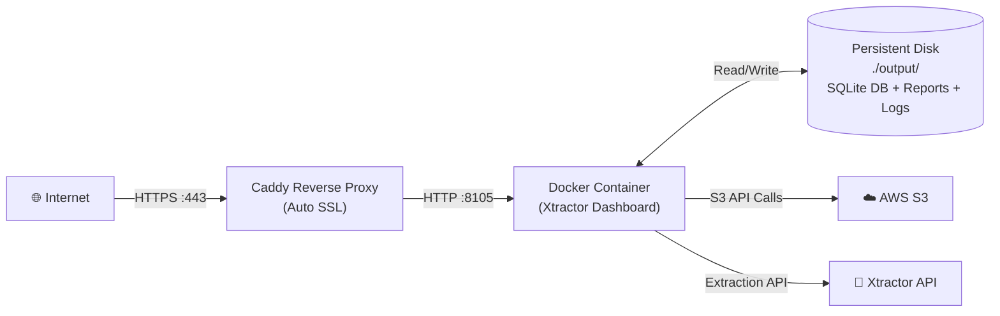

# Xtractor → Oracle Cloud Always Free Deployment Guide

A complete, step-by-step walkthrough to deploy the Xtractor dashboard on **Oracle Cloud's Always Free** ARM VM — **$0 forever**.

---

## Phase 1: Create Your Oracle Cloud Account

1. Go to [cloud.oracle.com/free](https://cloud.oracle.com/free) and click **Start for Free**
2. Fill in your details — choose **Home Region** carefully:
   - Pick **Mumbai (ap-mumbai-1)** — closest to you for lowest latency
   - ⚠️ You **cannot change** your home region after signup
3. Add a credit/debit card for verification — **you will NOT be charged**
4. After verification, you land on the **OCI Console Dashboard**

---

## Phase 2: Create an Always Free ARM VM Instance

### Step 2.1: Navigate to Compute
1. In the OCI Console, click the **hamburger menu (☰)** → **Compute** → **Instances**
2. Click **Create Instance**

### Step 2.2: Configure the Instance

| Setting | Value |
|:---|:---|
| **Name** | `xtractor-server` |
| **Compartment** | Leave default (root) |
| **Availability Domain** | Leave default |
| **Image** | **Canonical Ubuntu 22.04** (click *Change Image* → select Ubuntu) |
| **Shape** | Click *Change Shape* → **Ampere** → **VM.Standard.A1.Flex** |
| **OCPUs** | `2` (you get up to 4 free) |
| **Memory** | `12 GB` (you get up to 24 free) |
| **Boot Volume** | `50 GB` (default, up to 200 GB free) |

### Step 2.3: Network Configuration
- **VCN**: Let Oracle auto-create a VCN (or use an existing one)
- **Subnet**: Public subnet
- **Public IPv4 Address**: ✅ **Assign a public IPv4 address** — this is critical!

### Step 2.4: SSH Key Setup
- Select **Generate a key pair** and **download both keys** (private `.key` and public `.pub`)
- Save the private key somewhere safe (e.g., `C:\Users\yourname\.ssh\xtractor-key.key`)
- **You will need this key to SSH into the server**

### Step 2.5: Create the Instance
Click **Create**. Wait 2-3 minutes for it to provision. Once the status shows **RUNNING**, copy the **Public IP Address** displayed on the instance details page.

> [!IMPORTANT]
> If you get an "Out of capacity" error, this means the free ARM shapes are temporarily unavailable in your region. Keep retrying every few hours — availability fluctuates. Some people use automation scripts to retry, but manual retries usually succeed within a day.

---

## Phase 3: Open Firewall Ports

Oracle Cloud has **two firewalls** — the cloud-level **Security List** and the OS-level **iptables**. You must open ports in both.

### Step 3.1: Open Ports in OCI Security List
1. Go to **Networking** → **Virtual Cloud Networks** → click your VCN
2. Click your **Public Subnet** → click the **Default Security List**
3. Click **Add Ingress Rules** and add these two rules:

| Source CIDR | Protocol | Dest Port | Description |
|:---|:---|:---|:---|
| `0.0.0.0/0` | TCP | `80` | HTTP (Caddy) |
| `0.0.0.0/0` | TCP | `443` | HTTPS (Caddy) |

> [!NOTE]
> Do NOT expose port `8105` directly to the internet. Caddy will handle incoming traffic on ports 80/443 and proxy it internally to 8105.

### Step 3.2: Open Ports in OS Firewall (done in Phase 4 after SSH)

---

## Phase 4: Connect via SSH & Initial Server Setup

### Step 4.1: SSH into Your Server

From your Windows PowerShell terminal:
```powershell
# Fix key permissions (required on Windows)
icacls "C:\Users\yourname\.ssh\xtractor-key.key" /inheritance:r /grant:r "$($env:USERNAME):(R)"

# Connect via SSH
ssh -i "C:\Users\yourname\.ssh\xtractor-key.key" ubuntu@YOUR_PUBLIC_IP
```

Replace `YOUR_PUBLIC_IP` with the IP address from Phase 2.

### Step 4.2: Update the System
```bash
sudo apt update && sudo apt upgrade -y
```

### Step 4.3: Open OS-Level Firewall Ports
Ubuntu on Oracle Cloud uses `iptables` by default. Open the required ports:
```bash
sudo iptables -I INPUT 6 -m state --state NEW -p tcp --dport 80 -j ACCEPT
sudo iptables -I INPUT 6 -m state --state NEW -p tcp --dport 443 -j ACCEPT

# Persist the rules across reboots
sudo apt install -y iptables-persistent
sudo netfilter-persistent save
```

---

## Phase 5: Install Docker

```bash
# Install Docker
curl -fsSL https://get.docker.com -o get-docker.sh
sudo sh get-docker.sh

# Add your user to the docker group (avoids needing sudo for every command)
sudo usermod -aG docker $USER

# Install Docker Compose plugin
sudo apt install -y docker-compose-plugin

# Apply group changes (or just log out and back in)
newgrp docker

# Verify installation
docker --version
docker compose version
```

---

## Phase 6: Deploy Xtractor

### Step 6.1: Clone the Repository
```bash
mkdir -p /opt/xtractor
cd /opt/xtractor
git clone https://github.com/for-qa/xtractor.git .
```

### Step 6.2: Configure Environment Variables
```bash
cp .env.example .env
nano .env
```

Fill in your real credentials:
```env
XTRACTOR_BASE_URL=https://your-api.example.com
FERNET_KEY=your-real-fernet-key
XTRACTOR_ACCESS_KEY_ENCRYPTED=gAAAAABl...your-real-token
XTRACTOR_SECRET_MESSAGE_ENCRYPTED=gAAAAABl...your-real-token
XTRACTOR_SIGNATURE_ENCRYPTED=gAAAAABl...your-real-token

AWS_ACCESS_KEY_ID_ENCRYPTED=gAAAAABl...your-real-token
AWS_SECRET_ACCESS_KEY_ENCRYPTED=gAAAAABl...your-real-token
AWS_REGION=us-west-2
S3_BUCKET=your-bucket-name
S3_TENANT_PURCHASERS={"brand-a":["PURCHASER_1"]}
```

Save and exit (`Ctrl+X` → `Y` → `Enter`).

### Step 6.3: Build and Start the Container
```bash
docker compose up -d --build
```

This will:
1. Build the multi-stage Docker image (~2-4 min on ARM)
2. Compile TypeScript and native `better-sqlite3` bindings
3. Start the Xtractor dashboard on port `8105` internally

### Step 6.4: Verify It's Running
```bash
# Check container status
docker compose ps

# Check logs
docker compose logs -f --tail 50
```

You should see:
```
xtractor-app  | Xtractor app: http://localhost:8105/
```

At this point, the dashboard is running **internally** on the VM. Next, we expose it to the internet with HTTPS.

---

## Phase 7: Setup Caddy Reverse Proxy (Automatic HTTPS)

Caddy automatically provisions **free SSL certificates** from Let's Encrypt. Zero manual certificate management.

### Option A: With a Custom Domain (Recommended)

#### Step 7.1: Point Your Domain
In your domain registrar (Namecheap, Cloudflare, GoDaddy, etc.), create an **A record**:

| Type | Name | Value |
|:---|:---|:---|
| A | `xtractor` (or `@` for root) | `YOUR_PUBLIC_IP` |

#### Step 7.2: Install and Configure Caddy
```bash
sudo apt install -y debian-keyring debian-archive-keyring apt-transport-https
curl -1sLf 'https://dl.cloudsmith.io/public/caddy/stable/gpg.key' | sudo gpg --dearmor -o /usr/share/keyrings/caddy-stable-archive-keyring.gpg
curl -1sLf 'https://dl.cloudsmith.io/public/caddy/stable/debian.deb.txt' | sudo tee /etc/apt/sources.list.d/caddy-stable.list
sudo apt update
sudo apt install caddy
```

#### Step 7.3: Configure the Caddyfile
```bash
sudo nano /etc/caddy/Caddyfile
```

Replace the entire contents with:
```caddy
xtractor.yourdomain.com {
    reverse_proxy localhost:8105
}
```

Save and restart Caddy:
```bash
sudo systemctl restart caddy
sudo systemctl enable caddy
```

Caddy will automatically fetch an SSL certificate. Your dashboard is now live at:
**`https://xtractor.yourdomain.com`** 🎉

---

### Option B: Without a Domain (IP-only Access)

If you don't have a domain, you can still access the dashboard — just without HTTPS:

```bash
# Skip Caddy entirely. Instead, open port 8105 directly:
sudo iptables -I INPUT 6 -m state --state NEW -p tcp --dport 8105 -j ACCEPT
sudo netfilter-persistent save
```

Access your dashboard at: `http://YOUR_PUBLIC_IP:8105`

> [!WARNING]
> This approach sends all traffic (including API credentials in the dashboard forms) over unencrypted HTTP. Only use this for testing or internal-only access. For production, use a domain with Caddy HTTPS.

---

## Phase 8: Automated Backups & Maintenance

### SQLite Database Backup Script
Create a daily backup cron job to protect your extraction data:

```bash
sudo nano /opt/xtractor/backup.sh
```

```bash
#!/bin/bash
BACKUP_DIR="/opt/xtractor/backups"
TIMESTAMP=$(date +"%Y%m%d_%H%M%S")
DB_PATH="/opt/xtractor/output/Xtractor.db"

mkdir -p "$BACKUP_DIR"

# Safe online backup (no corruption risk during active writes)
sqlite3 "$DB_PATH" ".backup '${BACKUP_DIR}/Xtractor_${TIMESTAMP}.db'"

# Retain only last 30 backups
find "$BACKUP_DIR" -type f -name "*.db" -mtime +30 -delete

echo "[$(date)] Backup created: Xtractor_${TIMESTAMP}.db"
```

```bash
chmod +x /opt/xtractor/backup.sh

# Schedule daily midnight backup
(crontab -l 2>/dev/null; echo "0 0 * * * /opt/xtractor/backup.sh >> /opt/xtractor/backups/backup.log 2>&1") | crontab -
```

### Updating Xtractor (Future Deployments)
When you push new code to GitHub:
```bash
cd /opt/xtractor
git pull
docker compose up -d --build
```
That's it — Docker rebuilds and restarts. Your SQLite data in `./output` is preserved across rebuilds.

---

## 🗺️ Architecture on Oracle Cloud



---

## ✅ Final Checklist

- [ ] Oracle Cloud account created (Mumbai region)
- [ ] Always Free ARM VM provisioned (Ubuntu 22.04, 2 OCPU, 12GB RAM)
- [ ] SSH key downloaded and connection tested
- [ ] Security List ingress rules added (ports 80, 443)
- [ ] OS-level iptables rules added and persisted
- [ ] Docker + Docker Compose installed
- [ ] Repository cloned to `/opt/xtractor`
- [ ] `.env` configured with real credentials
- [ ] `docker compose up -d --build` succeeded
- [ ] Domain A record pointed to VM public IP
- [ ] Caddy configured and HTTPS working
- [ ] Backup cron job scheduled
- [ ] Dashboard accessible at `https://xtractor.yourdomain.com` 🎉
